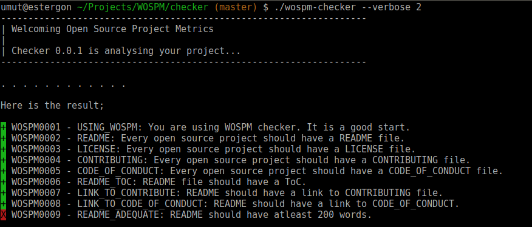

# WOSPM Checker

A checker for project owners to measure their open source project.

[](CONTRIBUTING.md) [](https://circleci.com/gh/WOSPM/checker) 

---

<!-- START doctoc generated TOC please keep comment here to allow auto update -->
<!-- DON'T EDIT THIS SECTION, INSTEAD RE-RUN doctoc TO UPDATE -->
## Table Of Contents

- [Introduction](#introduction)
- [How To Install And Use](#how-to-install-and-use)
- [To Be Considered](#to-be-considered)
- [WOSPM Metrics](#wospm-metrics)
  - [Metric Rules](#metric-rules)
  - [List of Existing Metrics](#list-of-existing-metrics)
  - [Badges](#badges)
- [Contributing](#contributing)
- [Code of Conduct](#code-of-conduct)

<!-- END doctoc generated TOC please keep comment here to allow auto update -->

---

## Introduction

`wospm-checker` is a commandline tool to measure how an open source project welcomes users and possible contributors. The tool checks the repository against a list of metrics. The metrics are mostly inspired by [Github's Open Source Guides](https://opensource.guide/).

## How To Install And Use

Install the package with composer.

```bash
composer global require wospm/checker

```

You can use `--help` parameter to how the options and other information of the command.

```bash

wospm-checker --help

WOSPM Checker version: 0.0.1
Options:
    --output            The format of output. JSON, READABLE (Default), NO, HTML.
    --verbose           Show the progress or not. (0 => No, 1 => Detailed,
                        2 => Dots)
    --no-colors         Disable the console colors. It is enabled by default.
    --version           Show version.
    --help              Print this help.


```

You can check your project by running the `wospm-checker` command in the root folder of your repo.

```bash
/full/path/to/wospm-checker
```



## To Be Considered

**GitHub Rest API Rate Limit** :exclamation::exclamation::exclamation:

`wospm-checker` uses GitHub Rest API to fecth repository information in some of the metric checks. There some [limits](https://developer.github.com/v3/#rate-limiting) in using this API. When you use `wospm-checker` very frequently, you may hit the wall of anonymous limit of the API.

```bash
Client error: `GET https://api.github.com/repos/user/repo/labels` resulted in a `403 Forbidden` response:
{
  "message": "API rate limit exceeded for XX.XX.XX.XXX. (But here's the good news: Authenticated requests get a higher (truncated...)
```

You can use your [personal access token](https://github.com/settings/tokens) to have a bigger rate limit. In order to do this, you need to create a YML file with name `.wospm` under the root folder of the repository to be checked.

```yml
github:
    auth_token: PERSONAL_ACCESS_TOKEN

```

## WOSPM Metrics

WOSPM metrics are measures to make quantitative assessments about the open sourse projects if they are contributor friendly or not. They are not scientific values which are mostly derived from [Open Source Guides](https://opensource.guide/).

### Metric Rules

1. Every metric should check only one simple case
2. Metrics can be dependent to each other (If there is no README, no need to make any check in README content etc.)
3. Every metric should have a unique WOSPMXXX number and a unique title (uppercase and snake-case).

For more information about adding a new metric to the project, please [Add New Metric](./CONTRIBUTING.md#add-new-metric) section.

### List of Existing Metrics

To see the details of the metrics, click the metric title for detailed document.

| Code        | Title           | Description     |
| ------------- |-------------|-------------|
| [WOSPM0001](./mdocs/WOSPM0001.md)      | USING_WOSPM | You are using WOSPM checker. It is a good start. |
| [WOSPM0002](./mdocs/WOSPM0002.md)      | README | Every open source project should have a README file. |
| [WOSPM0003](./mdocs/WOSPM0003.md)      | LICENSE | Every open source project should have a LICENSE file. |
| [WOSPM0004](./mdocs/WOSPM0004.md)      | CONTRIBUTING | Every open source project should have a CONTRIBUTING file. |
| [WOSPM0005](./mdocs/WOSPM0005.md)      | CODE_OF_CONDUCT | Every open source project should have a CODE_OF_CONDUCT file. |
| [WOSPM0006](./mdocs/WOSPM0006.md)      | README_TOC | Every README file should have table of contents list. |
| [WOSPM0007](./mdocs/WOSPM0007.md)      | LINK_TO_CONTRIBUTE | README should have a link to CONTRIBUTING file. |
| [WOSPM0008](./mdocs/WOSPM0008.md)      | LINK_TO_CODE_OF_CONDUCT | README should have a link to NO_LINK_TO_CODE_OF_CONDUCT file. |
| [WOSPM0009](./mdocs/WOSPM0009.md)      | README_ADEQUATE | README should have atleast 200 words. |
| [WOSPM0010](./mdocs/WOSPM0010.md)      | INSTALLATION_SECTION | README file should have an installation section. |
| [WOSPM0011](./mdocs/WOSPM0011.md)      | GITHUB_ISSUE_TEMPLATE | You should have issue templates on Github. |
| [WOSPM0012](./mdocs/WOSPM0012.md)      | GITHUB_PR_TEMPLATE | You should have PR template on Github. |
| [WOSPM0013](./mdocs/WOSPM0013.md)      | GITHUB_SHORT_DESCRIPTION | Project should have a short description on Github. |
| [WOSPM0014](./mdocs/WOSPM0014.md)      | GITHUB_TOPICS | Related topics should be added to the repository. |
| [WOSPM0015](./mdocs/WOSPM0015.md)      | GITHUB_LABELS | Project should have issue labels. |
| [WOSPM0016](./mdocs/WOSPM0016.md)      | GITHUB_LABELS_USED | Labels should be used to highlight the issues. |
| [WOSPM0017](./mdocs/WOSPM0017.md)      | GITHUB_CUSTOM_LABELS | Creating custom labels is a good practice. |
| [WOSPM0018](./mdocs/WOSPM0018.md)      | GITHUB_LABELS_GFI_HW | _good first issue_ and _help wanted_ labels should exist. |
| [WOSPM0019](./mdocs/WOSPM0019.md)      | GITHUB_CUSTOM_LABELS_USED | At least one custom label should be associated to an issue. |
| [WOSPM0020](./mdocs/WOSPM0020.md)      | GITHUB_LABELS_GFI_HW_USED | _good first issue_ and "help wanted" labels should be used. |
| [WOSPM0021](./mdocs/WOSPM0021.md)      | GITHUB_RESPONSIVENESS | Responsive owners encourage users to be contributors. |
| [WOSPM0022](./mdocs/WOSPM0022.md)      | GITHUB_CUSTOM_LABEL_DESCRIPTON | Custom labels should have descriptions. |

### Badges

After the check, the checker will generate a overall status for the project. There types of status are considered;

- *Perfect:* It means that the porject covers 100 percent of the metrics. 
- *Welcoming:* It means that the project covers atleast 90 percent of the metrics. 
- *Not Ready:* It means that the project is not ready to be accepted as *Welcoming*. The project covers between 50 and 90 percents of the metrics. 
- *Bad:* I means that the project is in very bad status. The coverage is under 50 percent. 

The checker generates the badge code of the project at the end of the the execution.

## Contributing

See [CONTRIBUTING.md](CONTRIBUTING.md) for information.

## Code of Conduct

See [CODE_OF_CONDUCT](CODE_OF_CONDUCT) for information.
